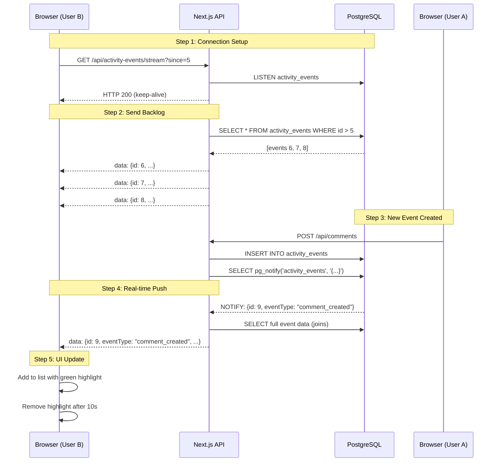
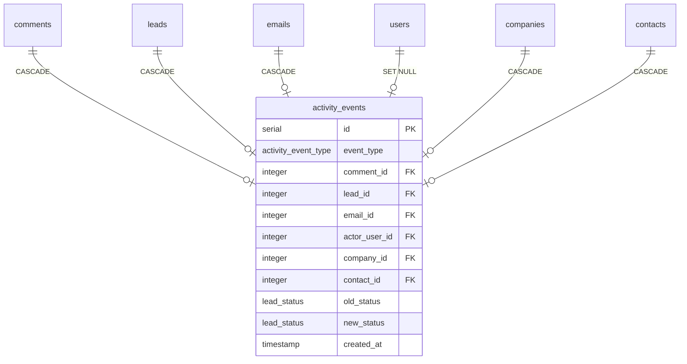
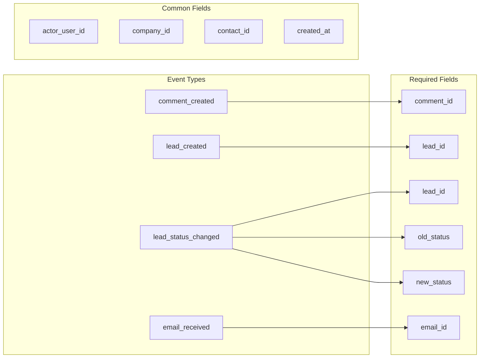
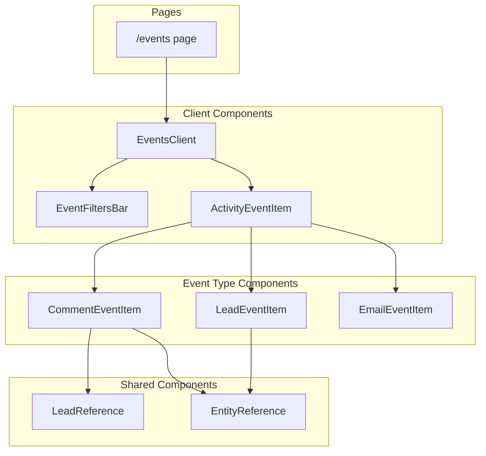

# Activity Events (Hendelseslogg)

This document explains the real-time Activity Events system that powers the Hendelseslogg (Events) page.

## Overview

The activity events system tracks CRM actions (comments, leads, emails) and broadcasts them in real-time using Server-Sent Events (SSE) and PostgreSQL's LISTEN/NOTIFY.

## Key Concepts

### 1. pg_notify

`pg_notify` is a PostgreSQL function that sends messages to a "channel". Any client listening to that channel receives the message instantly.

```sql
-- Send a message
SELECT pg_notify('my_channel', 'Hello!');

-- In another connection
LISTEN my_channel;  -- Receives: "Hello!"
```

**Current implementation**: Application-level (called from code after insert)

```typescript
// src/db/activity-events.ts
await pool.query("SELECT pg_notify($1, $2)", ["activity_events", JSON.stringify(event)]);
```

**Why application-level (not database trigger)?**

- All event creation goes through the typed helper functions in `src/db/activity-events.ts`
- Direct DB inserts are rare in this application (no migrations create events, no external services)
- Application-level gives us more control over the notification payload
- Simpler to maintain and debug than database triggers

**Limitation**: If events are created directly in the DB (e.g., via psql, migrations, or another service), SSE clients won't receive real-time updates. They will still appear on page refresh.

**Alternative**: Database trigger (more robust, captures all inserts) - consider if direct DB inserts become common.

### 2. InferSelectModel / InferInsertModel

Drizzle ORM utilities that derive TypeScript types from your schema:

```typescript
import { InferSelectModel, InferInsertModel } from "drizzle-orm";

// What you GET from database (all fields present)
type ActivityEvent = InferSelectModel<typeof activityEvents>;

// What you SEND to insert (fields with defaults are optional)
type NewActivityEvent = InferInsertModel<typeof activityEvents>;
```

## SSE Flow



## Database Schema



## Schema Design Decisions

### Separate Table vs. Modifying Existing `events`

The existing `events` table stores everything as a text `description`. To make events clickable and filterable, we created a new `activity_events` table with structured data. This means:

- No risky migrations on existing data
- Can run both systems in parallel during transition
- Clean slate with proper design

### `eventType` Enum Instead of Text

```typescript
activityEventTypeEnum: ["comment_created", "lead_created", "lead_status_changed", "email_received"];
```

**Why?**

- **Type safety** - TypeScript knows exactly what values are valid
- **Query performance** - Enums are stored as integers internally, faster than text comparison
- **UI routing** - Easy to switch/case on event type to render different components
- **Filtering** - `WHERE event_type = 'comment_created'` is fast and clean

### Polymorphic References (commentId, leadId, emailId)

**Why separate columns instead of one `sourceId` + `sourceType`?**

| Approach                         | Pros                                             | Cons                                                                 |
| -------------------------------- | ------------------------------------------------ | -------------------------------------------------------------------- |
| Single `sourceId` + `sourceType` | One column                                       | No FK constraints, can have orphans, need CASE statements in queries |
| **Separate columns**             | FK constraints work, JOINs are simple, type-safe | Multiple nullable columns                                            |

With separate columns:

- Database **enforces referential integrity** - can't point to non-existent comment
- `ON DELETE CASCADE` works - if comment deleted, event deleted too
- JOINs are straightforward: `LEFT JOIN comments ON activity_events.comment_id = comments.id`

### Denormalized `companyId` and `contactId`

**Why duplicate data that exists in the referenced tables?**

This is **intentional denormalization** for filtering performance:

```sql
-- Without denormalization (slow, complex):
SELECT * FROM activity_events ae
LEFT JOIN comments c ON ae.comment_id = c.id
LEFT JOIN leads l ON ae.lead_id = l.id
LEFT JOIN emails e ON ae.email_id = e.id
WHERE c.company_id = 5 OR l.company_id = 5 OR e.recipient_company_id = 5

-- With denormalization (fast, simple):
SELECT * FROM activity_events WHERE company_id = 5
```

**Trade-off**: We store company/contact IDs twice, but:

- Filter queries are **10x+ faster** (single index scan)
- Query complexity drops significantly
- Storage cost is negligible (a few bytes per row)

### `actorUserId` for "Who did this?"

- Enables "Filter by user" feature
- Shows "Marina created this comment" in UI
- Nullable because some events are system-triggered (email received has no human actor)

### `oldStatus` / `newStatus` for Lead Changes

**Why not just store a text description?**

For the "Status: Ny → Tilbud" display, we need:

- The actual enum values to render proper badges/colors
- Ability to filter "show me all events where status changed TO 'WON'"
- Type safety - can't store invalid status values

### `ON DELETE CASCADE` Strategy

**Why cascade?**

- If a comment is deleted, its activity event should also disappear
- Prevents orphaned events pointing to nothing
- Alternative would be `SET NULL`, but then we'd have events with no content to display

**Exception**: `actor_user_id` uses `SET NULL` to preserve history even if user is deleted.

## Event Types and Their Data



## Component Architecture



## API Endpoints

| Endpoint                      | Method | Description                                  |
| ----------------------------- | ------ | -------------------------------------------- |
| `/api/activity-events`        | GET    | List events with filters (cursor pagination) |
| `/api/activity-events/stream` | GET    | SSE stream for real-time updates             |

### Query Parameters (GET /api/activity-events)

| Param       | Type   | Description                                  |
| ----------- | ------ | -------------------------------------------- |
| `limit`     | number | Max events to return (default: 50, max: 200) |
| `before`    | number | Cursor for pagination (event ID)             |
| `type`      | string | Comma-separated event types                  |
| `companyId` | number | Filter by company                            |
| `contactId` | number | Filter by contact                            |
| `userId`    | number | Filter by actor                              |
| `fromDate`  | string | ISO date string                              |
| `toDate`    | string | ISO date string                              |

## Migration Details

The migration (`drizzle/0014_cheerful_typhoid_mary.sql`) creates:

1. **ENUM type** for event types (database-enforced values)
2. **Table** with nullable columns for different event types
3. **Foreign keys** with appropriate CASCADE/SET NULL behavior

### Why CASCADE vs SET NULL?

| FK            | On Delete    | Reason                                |
| ------------- | ------------ | ------------------------------------- |
| comment_id    | CASCADE      | Event meaningless without comment     |
| lead_id       | CASCADE      | Event meaningless without lead        |
| email_id      | CASCADE      | Event meaningless without email       |
| actor_user_id | **SET NULL** | Preserve history even if user deleted |
| company_id    | CASCADE      | Events for deleted company not useful |
| contact_id    | CASCADE      | Events for deleted contact not useful |

## Performance Considerations

### Indexes

The following indexes are defined in the schema (`src/db/schema.ts`) to optimize query performance:

```sql
-- Added in migration 0015_gifted_gargoyle.sql
CREATE INDEX idx_activity_events_created_at ON activity_events(created_at DESC);
CREATE INDEX idx_activity_events_event_type ON activity_events(event_type);
CREATE INDEX idx_activity_events_company_id ON activity_events(company_id);
CREATE INDEX idx_activity_events_contact_id ON activity_events(contact_id);
CREATE INDEX idx_activity_events_actor_user_id ON activity_events(actor_user_id);
```

## Files

| File                                          | Purpose                           |
| --------------------------------------------- | --------------------------------- |
| `src/db/schema.ts`                            | Table definition with Drizzle     |
| `src/db/activity-events.ts`                   | Helper functions to create events |
| `src/app/api/activity-events/route.ts`        | List API with filtering           |
| `src/app/api/activity-events/stream/route.ts` | SSE streaming endpoint            |
| `src/app/events/events-client.tsx`            | Main UI component                 |
| `src/components/hendelseslogg/*.tsx`          | Event item components             |
| `src/components/activity-log/*.tsx`           | Shared activity log components    |
| `src/components/filters/event-filters.tsx`    | Filter UI component               |
